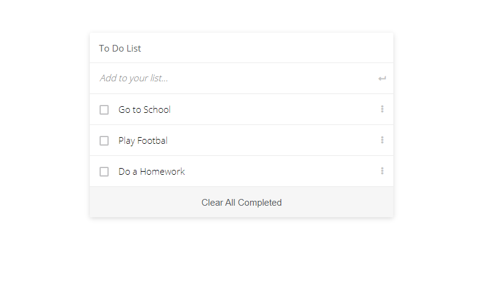

# ToDo-List-redo


# ToDo List Project

> This is a to do list app. You can organize your tasks


Here you can write your to dos, you can check it when you complete it, also you can remove.

## Built With

- HTML
- CSS
- JS

## Live Demo

https://elyor-doniyorov.github.io/ToDo-List-redo/


## Clone This Project
```
- git clone `$ https://github.com/elyor-doniyorov/ToDo-List-redo.git`
- cd ToDo-List-redo
- Type `npm install`.
- Now type `npm start`, YAY you can now see the project.
```

## Authors

👤 **Elyor Doniyorov**

- Github: [@elyor-doniyorov](https://github.com/elyor-doniyorov)
- LinkedIn: [@elyor-doniyorov](www.linkedin.com/in/elyor-doniyorov)


## 🤝 Contributing

Contributions, issues, and feature requests are welcome!

Feel free to check the [issues page](https://github.com/elyor-doniyorov/ToDo-List-redo/issues/2).

## Show your support

Give a ⭐️ if you like this project!
